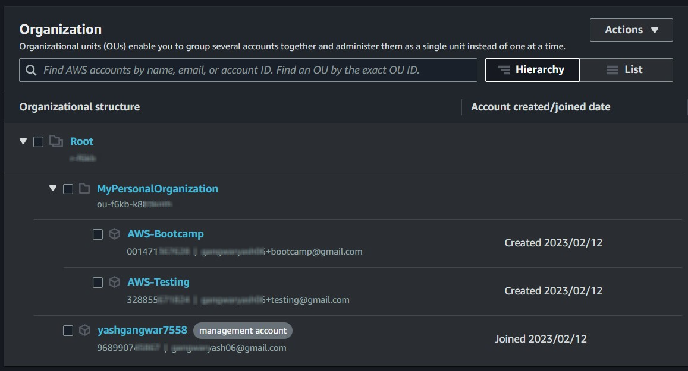
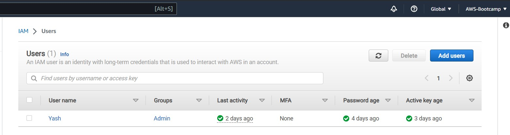
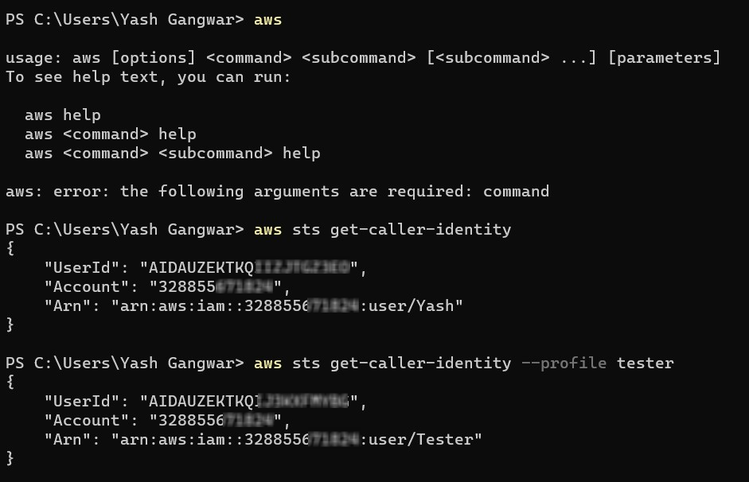
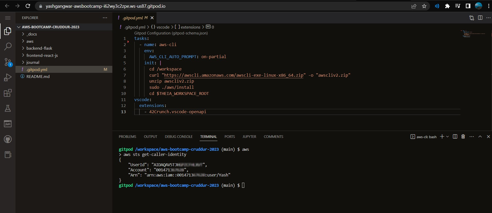
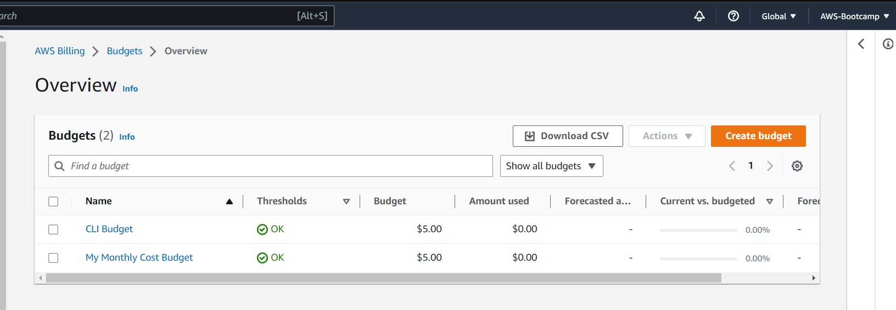
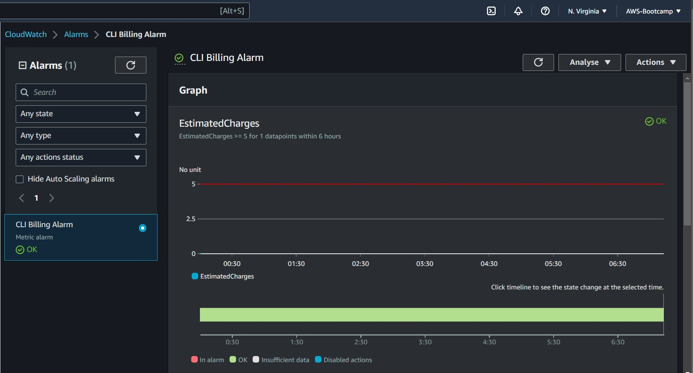
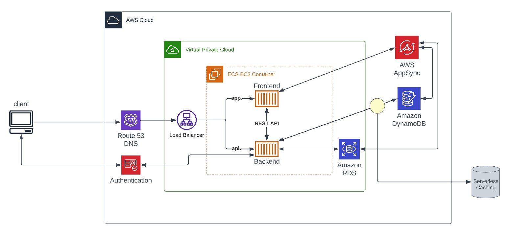

# Week 0 — Billing and Architecture

## AWS Organizations

I was searching for a way on AWS so that I can isolate my services and resources getting used for my personal projects with the services I wanted to use for this bootcamp, and then came to rescue a tutorial by [Cloud Security Podcast](https://youtu.be/4EMWBYVggQI) on setting up AWS Organization.

AWS organization helps up setup multiple accounts under your root account. Your root account only works for management purposes like for paying bills and managing diff accounts and polices for your organization. This helps you to setup different isolated accounts for different users and projects. 

So basically, I created my personal organization under which I craeted two accounts, one specifically for this AWS cloud project bootcamp and second one for testing out AWS services and features.



---

## Created user groups and users

Created user group named **Admin**, and under that craeted two different IAM users, one as the main user to setups services for bootcamp, and second as a testing user just to test out resources and services.

Created access tokens for both the users so that they can access AWS using CLI on local environment.



---

## Install and verify AWS cli setup

**Steps to setup AWS CLI on local environment:**

1) Create access token for the IAM user to access the account using CLI. For that go to IAM users > Users > Select the user > Security Credentials > Create access key > Select command line interface > Save your keys.
2) Open command prompt, or any other terminal.
3) To install AWS CLI refer to the [AWS documentation](https://docs.aws.amazon.com/cli/latest/userguide/getting-started-install.html).
4) Now we need to configure the cli using command `aws configure`. Enter the access key, credentials and default region.
5) The CLI is configured. You can verify it using command `aws sts get-caller-identity`.
6) Output should appear like this 👇



---

## Gitpod setup

I was succesfully able to setup Gitpod workspace as a code editor and configur aws cli in it.



---

## Setup budget using CLI

Creating Budgets is a great way to track you expenses on AWS. Its helps you to get to info of your current and forcasted expenses.It also alert you when your costs and usage, utilization, or coverage of Savings Plans and RIs exceed your budgeted amount.

Its very imp to setup budget before starting using any services on AWS

Budgets can be created either using the console or the AWS cli. I created a simple budget of 5$ using the cli, that alerts me when the current usage goes above 80% of the total budget.

Here is the code that can be used to create the simple budget 👇

`budget.json`
```
{
    "BudgetLimit": {
        "Amount": "5",
        "Unit": "USD"
    },
    "BudgetName": "CLI Budget",
    "BudgetType": "COST",
    "CostFilters": {
        "TagKeyValue": [
            "user:Key$value1",
            "user:Key$value2"
        ]
    },
    "CostTypes": {
        "IncludeCredit": true,
        "IncludeDiscount": true,
        "IncludeOtherSubscription": true,
        "IncludeRecurring": true,
        "IncludeRefund": true,
        "IncludeSubscription": true,
        "IncludeSupport": true,
        "IncludeTax": true,
        "IncludeUpfront": true,
        "UseBlended": false
    },
    "TimePeriod": {
        "Start": 1477958399,
        "End": 3706473600
    },
    "TimeUnit": "MONTHLY"
  }
```

You also need to create the notification alert and provide mail and threshold when you should receive notification for budget `budget-notifications-with-subscribers.json`.
```
[
    {
        "Notification": {
            "ComparisonOperator": "GREATER_THAN",
            "NotificationType": "ACTUAL",
            "Threshold": 80,
            "ThresholdType": "PERCENTAGE"
        },
        "Subscribers": [
            {
                "Address": "gangwaryash06+bootcamp@gmail.com",
                "SubscriptionType": "EMAIL"
            }
        ]
    }
  ]
```

To implement this code, run the following command: 

```
aws budgets create-budget \
    --account-id 111122223333 \
    --budget file://budget.json \
    --notifications-with-subscribers file://notifications-with-subscribers.json
```

For verification, go to AWS console and search for Budget in the Billing Dashboard section. You should be able to see your budget.



---

## Setup billing alarm using CLI

Billing Alarms are another way to track your expenses and prevent them from going out of your budget. You can perform different actions when your budget crosses a particular threshold like using a SNS service to send mail for budget limit exceeding.

Billing alarms can also be setup using the AWS CLI 👇

`alarm-config.json`

```
{
    "AlarmName": "CLI Billing Alarm",
    "AlarmDescription": "This alarm would be triggered if the daily estimated charges exceeds 5$",
    "ActionsEnabled": true,
    "AlarmActions": [
        "arn:aws:sns:us-east-1:001471367628:BootcampBillingAlarm"
    ],
    "EvaluationPeriods": 1,
    "DatapointsToAlarm": 1,
    "Threshold": 5,
    "ComparisonOperator": "GreaterThanOrEqualToThreshold",
    "TreatMissingData": "breaching",
    "Metrics": [{
        "Id": "m1",
        "MetricStat": {
            "Metric": {
                "Namespace": "AWS/Billing",
                "MetricName": "EstimatedCharges",
                "Dimensions": [{
                    "Name": "Currency",
                    "Value": "USD"
                }]
            },
            "Period": 86400,
            "Stat": "Maximum"
        },
        "ReturnData": false
    },
    {
        "Id": "e1",
        "Expression": "IF(RATE(m1)>0,RATE(m1)*86400,0)",
        "Label": "DailyEstimatedCharges",
        "ReturnData": true
    }]
  }
```

To implement this code, run the following command:

```
aws cloudwatch put-metric-alarm --cli-input-json file://alarm-config.json
```

For verification, go to AWS console and search for CloudWatch > Billings in the alarms section. You should be able to see your billing alarm.



---

## Recreate Logical Architectural Design

Recreated the logical architectural diagram for the cruddur application, representing how the application will run and work on the cloud. This exercise helped me a lot to playaround with Lucidcharts. Its an amazing tool if you want to build logical diagrams quickly.

I am attaching a [link](https://lucid.app/lucidchart/0d328f96-8057-46c2-979b-ebf94b0430b9/edit?viewport_loc=273%2C336%2C1765%2C838%2C0_0&invitationId=inv_5b6eaf40-3a4a-4522-b8e4-df4cc749aee2) to my lucid chart as a proof.



---


