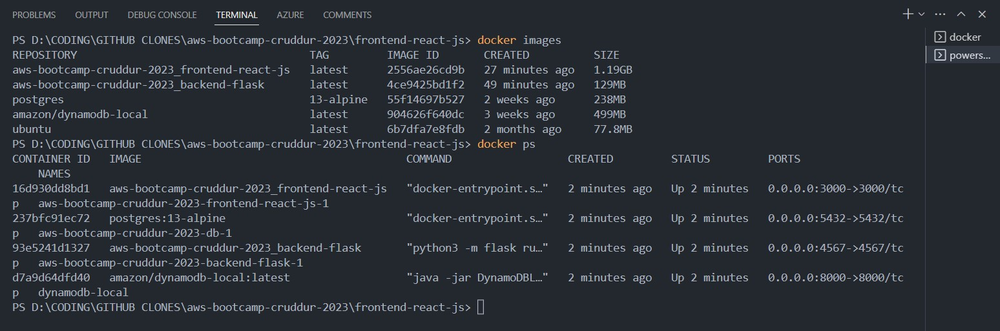
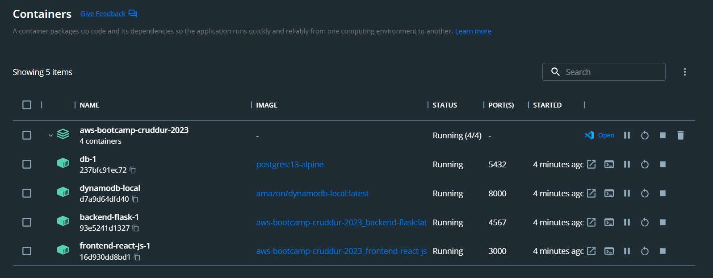
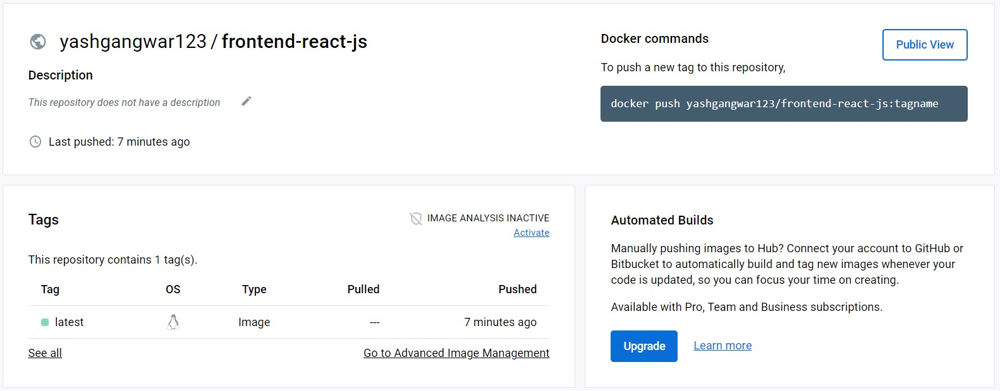
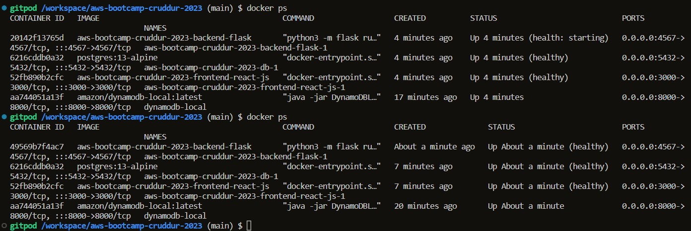
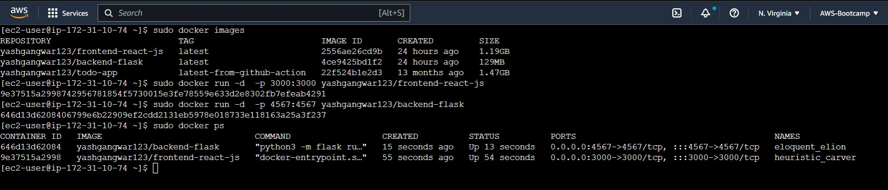
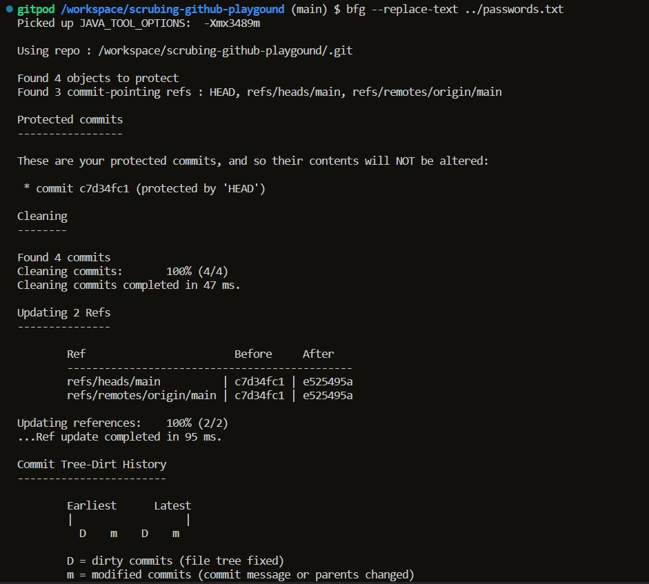
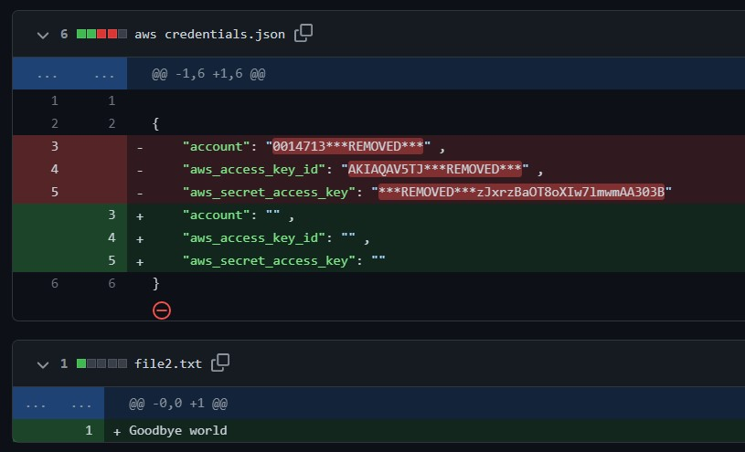
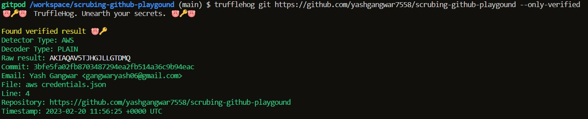

# Week 1 — App Containerization

<details open="open">
<summary>Table of Contents</summary>

- [Setting up Docker and Docker Desktop locally](#setting-up-docker-desktop-locally)
- [](#)
- [](#)
- [](#)
- [](#)
- [](#)

</details>

## Setting up Docker and Docker Desktop locally

1) Install docker locally using this [Get docker](https://docs.docker.com/get-docker/).
2) Clone the **aws-bootcamp-cruddur-2023** repo in your local system using command `git clone <repository link>`.
3) Now to build your images and get them running in containers, open the repo in terminal and run command `docker compose up` in the terminal.
4) To verify, that the images are build and containers are running.
    
   ```
   docker images
   docker ps
   ```
   
   
   
5) You can also setup **Docker Desktop**. It provides a straightforward GUI (Graphical User Interface) that lets you manage your containers, applications, and images 
   directly from your machine.

   To install docker desktop locally refer [here](https://docs.docker.com/desktop/). After installtaion and setting it up, you wil be able to see your containers and 
   images like this 👇

   

---

## Pushing images to docker hub

Docker Hub is a registry service on the cloud that allows you to download Docker images that are built by other communities. You can also upload your own Docker built images to Docker hub. To do that follow the steps:

1) Sign in to [Docker Hub](https://hub.docker.com/).
2) Create two new repositories, one for the frontend named `frontend-react-js` and second for the backend named `backend-flask`.
3) Now firstly you need to build your images that you can push to docker hub.
    
   **To build frontend image:**
   ```
   docker build -t frontend-react-js ./frontend-react-js
   ```
   
   **To build backend image:**
   ```
   docker build -t  backend-flask ./backend-flask
   ```
   
 4) Before pushing these images to docker hub you need to login to docker hub using ternimal.

    ```
    docker login
    ```
    Enter your username and password, and you are ready to push your images.
    
 5) **To push frontend image:**
    ```
    docker tag frontend-react-js yashgangwar123/frontend-react-js
    docker push yashgangwar123/frontend-react-js
    ```

    **To push backend image:**
    ```
    docker tag backend-flask yashgangwar123/backend-flask
    docker push yashgangwar123/backend-flask
    ```

    Open any repository on docker hub, and you can see your image there with the latest tag, like this 👇
    
    
    
    [Link to my public frontend repo on docker hub](https://hub.docker.com/repository/docker/yashgangwar123/frontend-react-js/general)
    
    [Link to my public backend repo on docker hub](https://hub.docker.com/repository/docker/yashgangwar123/backend-flask/general)
    
---

## Running dockerfile CMD as an External Script
   
  So this basically means that, suppose you have a CMD command that looks like this:
  ```yml
  CMD [ "python3", "-m" , "flask", "run", "--host=0.0.0.0", "--port=4567"]
  ```

  Now you need to create a file `external-script.py`, where you will put all your CMD commands and run them as external script like this:
  ```yml
  CMD [ "python3", "external-script.py"]
  ```

  Since, the **backend-flask** already has a entrypoint file as `app.py`. So we can simply run the command `python3 app.py` to run the backend, hence the CMD in 
  backend-flask dockerfile can be modified to:
  ```yml
  CMD [ "python3", "app.py"]
  ```

## Implementing health check on the docker containers 

With health checks, you can ensure that your applications running inside containers are functioning as expected. A health check is essentially a command or a script that runs inside the container to verify the health of the application. The health check can be configured to check things like the availability of a database, the responsiveness of a web server, or the successful completion of a batch job.

So, to perform a healthcheck in docker-compose files, you need to add a tag `healthcheck` in every service/container. Here is a example of very simple health check for my frontend container:

```yml
healthcheck:
      test: curl --fail https://4567-${GITPOD_WORKSPACE_ID}.${GITPOD_WORKSPACE_CLUSTER_HOST}/api/activities/home || exit 1
      interval: 60s
      retries: 5
      start_period: 20s
      timeout: 10s
```

Here I am doing a simple `curl` which has to pass to ensure that the container is healthy. One can also use `wget` for this purpose.

And here is my [docker-compose](../docker-compose.yml) file, where I have attached healthcheck attritube to every service/container. You can refer to this for proof.



---

## Running docker containers on AWS EC2 Instance

**Step1: Launching an EC2 instance**

1) Go to your AWS account, and search for EC2 and Create Instance.
2) Select free tier eligible Linux instances like `Amazon linux 2`.
3) You can go for `t2.micro` instance type as its free tier eligible.
4) Make sure you added security group rules for HTTP so that you can access this instance public. So checkbox on HTTP under Network Settings.
5) Create a key pair named `ec2-connect`, this will be required to ssh into your ec2 machine.
6) Finally launch the instance.

**Step2: Connecting to the EC2 instance**

1) Open the AWS cloud ssh terminal. You can find this on top right side.
2) Upload the key file named `ec2-connect` from the **Actions** button on terminal.
3) Run this command to not make your key publicly available
   ```
   chmod 400 ec2-connect.pem
   ```
4) Connect to your instance using its Public DNS. Eg.
   ```
   ssh i "ec2-connect" <Public DNS>
   ```

**Step3: Installing Docker on your EC2**

```
    // update
    sudo yum update -y

    // install most recent package
    sudo amazon-linux-extras install docker

    // start the service docker
    sudo service docker start

    // add the ec2-docker user to the group
    sudo usermod -a -G docker ec2-user

    // you need to logout to take affect logout
    // login again
    ssh -i "ec2-docker.pem" ec2-user@ec2-3-18-220-172.us-east-2.compute.amazonaws.com

    // check the docker version
    docker --version
  ```

**Step4: Running docker containers**

  1) Pulling and running Docker images from Docker hub.
     ```
     // running the frontend image
     sudo docker run -d -p 3000:3000 yashgangwar123/frontend-react-js 
     // running the backend image
     sudo docker run -d -p 4567:4567 yashgangwar123/backend-flask
     ```

   2) To verify the images are pulled and container are running
      ```
      sudo docker images
      sudo docker pull
      ```
      
      
      
---

## Tried using TruffleHog and BFG to clean the commit history

   

   
   
   

---


