# Week 2 — Distributed Tracing

## Homework Challenges 

<details open="open">
<summary>Table of Contents</summary>
  
- [Instrumenting Backend with Open Telemetry and Honeycomb](#instrumenting-backend-with-open-telemetry-and-honeycomb)
- [Adding custom span and attributes to send data to Honeycomb](#adding-custom-span-and-attributes-to-send-data-to-honeycomb)
- [Running queries over Traces in Honeycomb](#running-queries-over-traces-in-honeycomb)
- [Instrumenting Frontend as Browser with Open Telemetry and Honeycomb](#instrumenting-frontend-as-browser-with-open-telemetry-and-honeycomb)
- [Instrument AWS X-Ray into backend flask application with Segments and Subsegments](#instrument-aws-x-ray-into-backend-flask-application-with-segments-and-subsegments)
- [Integrate Rollbar for Error Logging with custom warning error trigger](#integrate-rollbar-for-error-logging-with-custom-warning-error-trigger)
  
</details>

---

## Instrumenting Backend with Open Telemetry and Honeycomb

Followed the FREE AWS Cloud Project Bootcamp (Week 2) - Distributed Tracing [live stream](https://www.youtube.com/live/2GD9xCzRId4?feature=share) to successfully instrumennt OTEL on my backend-flask application to send data to Honeycomb.io

Also, followed the official documentation to add additional configuration, like custom spans and subsegments. Refer [OpenTelemetry for Python](https://docs.honeycomb.io/getting-data-in/opentelemetry/python/#:~:text=Configure%20OpenTelemetry%20to%20send%20events,name%20is%20specified%20by%20OTEL_SERVICE_NAME%20)

Here, is the code you can refer on how to configure OTEL for tracing in [app.py](../backend-flask/app.py)

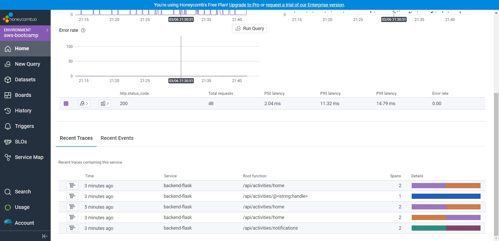

---

## Adding custom span and attributes to send data to Honeycomb

Each span represents a specific unit of work that occurred within your application, such as a database query or an HTTP request. Spans contain information such as the start and end time of the event, any associated metadata or context, and any relevant performance metrics or logs.

By capturing spans and sending them to Honeycomb's platform, you can gain insights into the performance and behavior of your application, allowing you to identify and diagnose issues, optimize performance, and make data-driven decisions about your system.

I created custom spans with custom attributes to trace different endpoints of the application

### 1. Custom span for service `home_activities.py` to trace the endpoint `api/activities/home`
     
   Find the code on how to instrument `home_activities.py` to create custom trace. [home_activities.py](../backend-flask/services/home_activities.py)
   
   
   
### 2. Custom span for service `notifications_activities.py` to trace the endpoint `/api/activities/notifications`
     
   Find the code on how to instrument `home_activities.py` to create custom trace. [notifications_activities.py](../backend-flask/services/notifications_activities.py)
   
   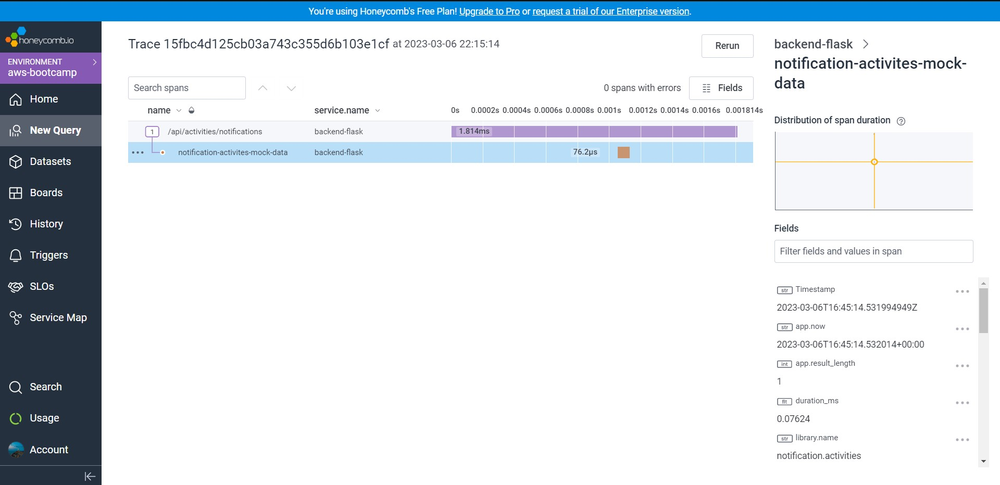
   
### 3. Custom span to trace the endpoint `/api/activities/@<string:handle>`

   This helps to trace the activities for every username. Also, added custom attributes like **username**, to help to easily find them using queries.
   
   Here, is how you can configure
   
   ```javascript
   @app.route("/api/activities/@<string:handle>", methods=['GET'])
   @xray_recorder.capture('activities_show')
    def data_handle(handle):
      # honeycomb-----
      with tracer.start_as_current_span("user-activities-mock-data"):
        span = trace.get_current_span()
        now = datetime.now(timezone.utc).astimezone()
        span.set_attribute("app.now", now.isoformat())
        model = UserActivities.run(handle)
        if model['errors'] is not None:
          span.set_attribute("user_name", handle)
          return model['errors'], 422
        else:
          span.set_attribute("user_name", handle)
          return model['data'], 200
        span.set_attribute("user_name", handle)
   ```
   
   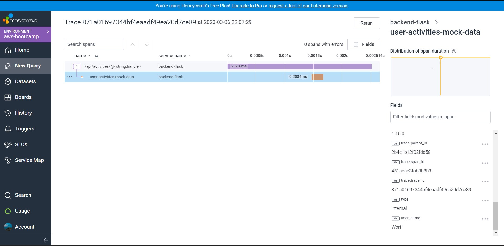
   
---

## Running queries over Traces in Honeycomb

Honeycomb queries are used to analyze and visualize the data that has been collected by instrumenting your code with Honeycomb's SDK. Queries can be used to filter, aggregate, and group your data in order to gain insights into the performance and behavior of your application.

Here are some interesting queries I ran over collected traces:

1. Query to get traces with `name = /api/activities/home` and `duration_ms >= 2`. Duration factor helps to find out where the application is going slow and find out the reason.

   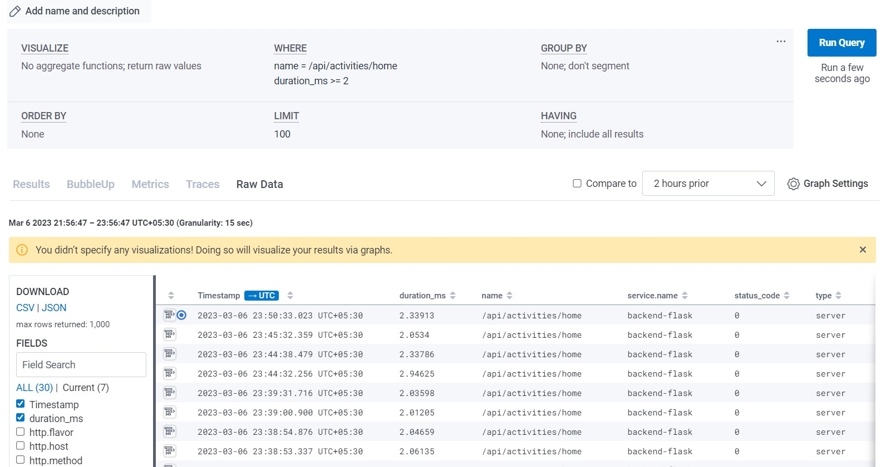

2. Query to get traces with `name = /api/activities/home` and `username != coco`. This helps to traces of all usernames except one.

   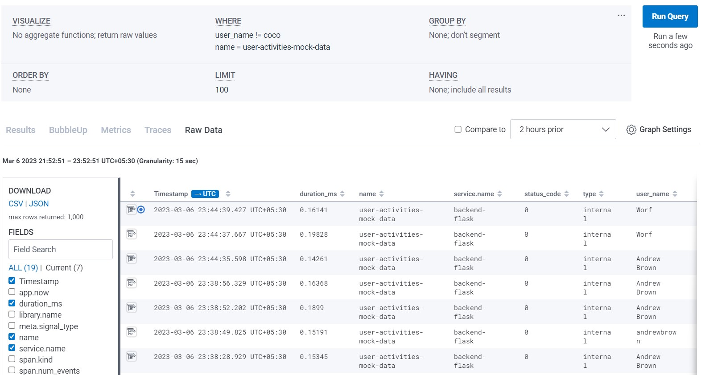
   
3. Query to get traces with `username = worf`. This can be used to get traces of a particular username, this is where used-id or user-name attribute helps.

   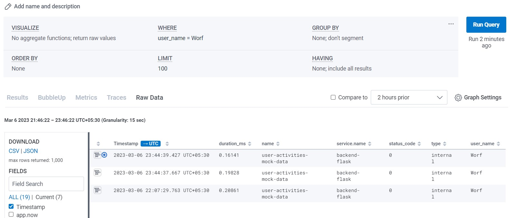
   
---

## Instrumenting Frontend as Browser with Open Telemetry and Honeycomb

Honeycomb uses opentelemetry collector for proxy collecting logs, traces and metrics. A collect consists of three parts:

- [Receivers](https://opentelemetry.io/docs/collector/configuration/#receivers)
- [Processors](https://opentelemetry.io/docs/collector/configuration/#processors)
- [Exporters](https://opentelemetry.io/docs/collector/configuration/#exporters)

[Honeycomb Reference](https://docs.honeycomb.io/getting-data-in/opentelemetry/browser-js/) is a good place for understanding how browser send events to honeycomb 

1. To configure it, a `otel-collector-config.yaml` is need it at your project directory (ex. alongside `docker-compose.yml`)

    ```yml
    receivers:
      otlp:
        protocols:
          http:
            cors:
              allowed_origins:
                - ${FRONTEND_URL_HTTPS}
                - ${FRONTEND_URL_HTTP}
    processors:
      batch:

    exporters:
      otlp:
        endpoint: "api.honeycomb.io:443"
        headers:
          "x-honeycomb-team": "${HONEYCOMB_API_KEY}"
      logging:
        loglevel: debug

    service:
      pipelines:
        traces:
          receivers: [otlp]
          processors: [batch]
          exporters: [otlp]
    ```

2. Then in `docker-compose` you would need the opentelemetry service setup to take in the configuration:

    ```yaml
    otel-collector:
        environment:
          FRONTEND_URL_HTTPS: "https://3000-${GITPOD_WORKSPACE_ID}.${GITPOD_WORKSPACE_CLUSTER_HOST}"
          FRONTEND_URL_HTTP: "http://3000-${GITPOD_WORKSPACE_ID}.${GITPOD_WORKSPACE_CLUSTER_HOST}"
          HONEYCOMB_API_KEY: "${HONEYCOMB_API_KEY}"
        image: otel/opentelemetry-collector
        command: [ --config=/etc/otel-collector-config.yaml ]
        volumes:
          - "./otel-collector-config.yaml:/etc/otel-collector-config.yaml"
        ports:
          - 4318:4318 # OTLP http receiver
    ```

3. The following depedencies need to be installed using `npm install --save` in `frontend-react-js`:

    ```yml
      @opentelemetry/api # used for client side tracing calls
      @opentelemetry/sdk-trace-web \ # used for browser web tracer provider, proccessors
      @opentelemetry/exporter-trace-otlp-http \ # used for exporting traces using http protocol
      @opentelemetry/context-zone #  It supports binding a certain Span to a target that has "addEventListener" and "removeEventListener".

      # the rest are needed for automatically sending a trace for all http requests
      @opentelemetry/instrumentation \
      @opentelemetry/instrumentation-xml-http-request \
      @opentelemetry/instrumentation-fetch

      # optional dependencies for user interactions, long tasks, document loads
      @opentelemetry/instrumentation-document-load \
      @opentelemetry/instrumentation-user-interaction \
      @opentelemetry/instrumentation-long-task
    ```

4. In frontend-react-js

   Create `services/honeycomb/index.js` in frontend-react-js

    ```ts
    import { OTLPTraceExporter } from '@opentelemetry/exporter-trace-otlp-http';
    import { WebTracerProvider, BatchSpanProcessor } from '@opentelemetry/sdk-trace-web';
    import { ZoneContextManager } from '@opentelemetry/context-zone';
    import { Resource } from '@opentelemetry/resources';
    import { SemanticResourceAttributes } from '@opentelemetry/semantic-conventions';
    // import { trace } from '@opentelemetry/api';

    // For sending traces for all http requests
    import { XMLHttpRequestInstrumentation } from '@opentelemetry/instrumentation-xml-http-request';
    import { FetchInstrumentation } from '@opentelemetry/instrumentation-fetch';
    import { registerInstrumentations } from '@opentelemetry/instrumentation';
    import { DocumentLoadInstrumentation } from '@opentelemetry/instrumentation-document-load';

    const exporter = new OTLPTraceExporter({
      url: `${process.env.REACT_APP_OTEL_COLLECTOR_ENDPOINT}:443/v1/traces`,
    });

    const provider = new WebTracerProvider({
      resource: new Resource({
        [SemanticResourceAttributes.SERVICE_NAME]: 'browser',
      }),
    });

    provider.addSpanProcessor(new BatchSpanProcessor(exporter));
    provider.register({
      contextManager: new ZoneContextManager()
    });

    registerInstrumentations({
      instrumentations: [
        new XMLHttpRequestInstrumentation({
          propagateTraceHeaderCorsUrls: [
            new RegExp(`${process.env.REACT_APP_BACKEND_URL}`, 'g')
          ]
        }),
        new FetchInstrumentation({
          propagateTraceHeaderCorsUrls: [
            new RegExp(`${process.env.REACT_APP_BACKEND_URL}`, 'g')
          ]
        }),
        new DocumentLoadInstrumentation(),
      ],
    });
    // export const TraceProvider = ({ children }: any) => (<>{children} </>);
    ```

5. Import `services/honeycomb/index.js` in `index.js

    ```
    import './services/honeycomb/index.js'
    ```

6. In Backend-flask

   Make sure in CORS `allowed_headers` use a list instead and add `traceparent` to allow tracing association of frontend and backend requests

    ```python
    cors = CORS(
        app,
        resources={r"/api/*": {"origins": origins}},
        expose_headers="location,link",
        allow_headers=["content-type", "if-modified-since", "traceparent"],
        methods="OPTIONS,GET,HEAD,POST"
    )
    ```
    
7. Now do `docker compose up` to see the traces on the honeycomb dashboard with a new dataset created `browser`.

    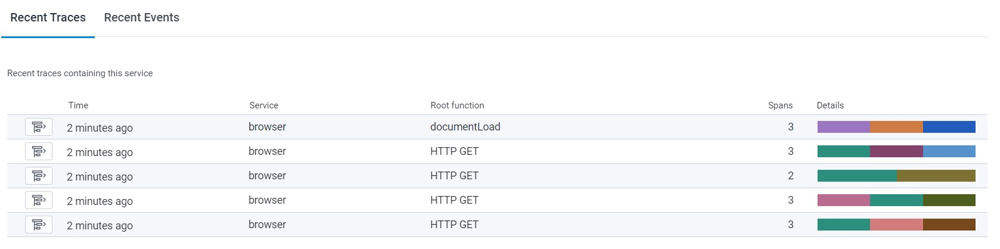
    
    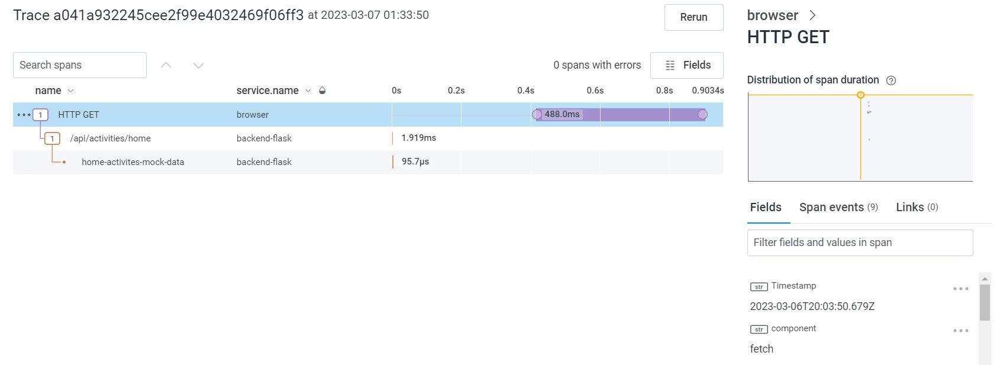
    
---

## Instrument AWS X-Ray into backend flask application with Segments and Subsegments

Followed the instructions from [Week-2 Instrument X-Ray](https://youtu.be/n2DTsuBrD_A) to instrument AWS X-Ray into backend-flask application.

Instrument AWS X-Ray for Flask

```
export AWS_REGION="ca-central-1"
gp env AWS_REGION="ca-central-1"
```

Add to `requirements.txt`

```
aws-xray-sdk
```

Install depedencies

```
pip install -r requirements.txt
```

Add a sampling rule file `aws/json/xray.json` that will be used by X-Ray to be fed into CLI later to setup X-Ray. This can also be setup in code for flask: <https://docs.aws.amazon.com/xray/latest/devguide/xray-sdk-python-configuration.html#xray-sdk-python-middleware-configuration-code>

```
{
  "SamplingRule": {
      "RuleName": "Cruddur",
      "ResourceARN": "*",
      "Priority": 9000,
      "FixedRate": 0.1,
      "ReservoirSize": 5,
      "ServiceName": "Cruddur",
      "ServiceType": "*",
      "Host": "*",
      "HTTPMethod": "*",
      "URLPath": "*",
      "Version": 1
  }
}
```

Use AWS CLI to create a group for X-ray then create sampling rule

```
FLASK_ADDRESS="https://4567-${GITPOD_WORKSPACE_ID}.${GITPOD_WORKSPACE_CLUSTER_HOST}"
aws xray create-group \
   --group-name "Cruddur" \
   --filter-expression "service(\"$FLASK_ADDRESS\") {fault OR error}"
aws xray create-sampling-rule --cli-input-json file://aws/json/xray.json
```

[Install X-Ray daemon](https://docs.aws.amazon.com/xray/latest/devguide/xray-daemon.html)
[X-Ray Daemon Github](https://github.com/aws/aws-xray-daemon)
[X-Ray Docker Compose](https://github.com/marjamis/xray/blob/master/docker-compose.yml)

Add Daemon Service to Docker compose

```
xray-daemon:
    image: "amazon/aws-xray-daemon"
    environment:
      AWS_ACCESS_KEY_ID: "${AWS_ACCESS_KEY_ID}"
      AWS_SECRET_ACCESS_KEY: "${AWS_SECRET_ACCESS_KEY}"
      AWS_REGION: "ca-central-1"
    command:
      - "xray -o -b xray-daemon:2000"
    ports:
      - 2000:2000/udp
```

We need to add these two env vars to our backend-flask in our docker-compose.yml file

```
    AWS_XRAY_URL: "*4567-${GITPOD_WORKSPACE_ID}.${GITPOD_WORKSPACE_CLUSTER_HOST}*"
    AWS_XRAY_DAEMON_ADDRESS: "xray-daemon:2000"
```

Check the service for the last 10 minutes

```
EPOCH=$(date +%s)
aws xray get-service-graph --start-time $(($EPOCH-600)) --end-time $EPOCH
```

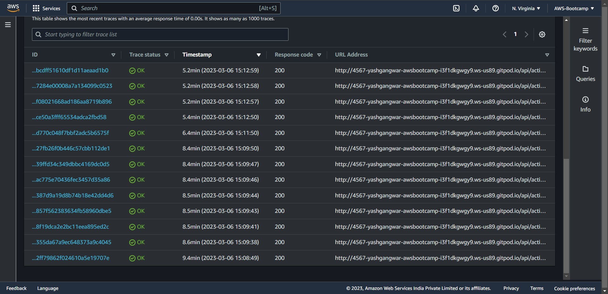
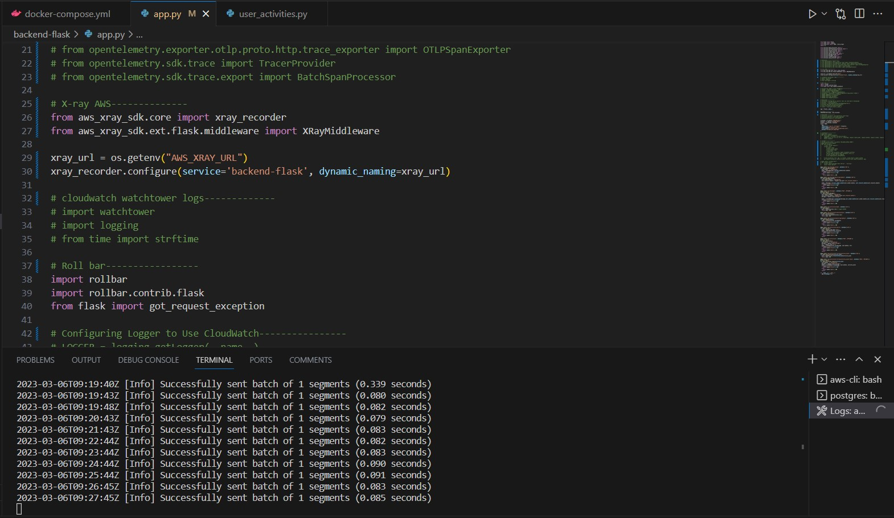

### Created subsegments to trace a particular api endpoint and block of code.

Created subsegments for `services/user_activities.py`

```javascript
from datetime import datetime, timedelta, timezone
from aws_xray_sdk.core import xray_recorder

class UserActivities:
  def run(user_handle):
    try:
      model = {
        'errors': None,
        'data': None
      }

      now = datetime.now(timezone.utc).astimezone()
      
      if user_handle == None or len(user_handle) < 1:
        model['errors'] = ['blank_user_handle']
      else:
        now = datetime.now()
        results = [{
          'uuid': '248959df-3079-4947-b847-9e0892d1bab4',
          'handle':  'Andrew Brown',
          'message': 'Cloud is fun!',
          'created_at': (now - timedelta(days=1)).isoformat(),
          'expires_at': (now + timedelta(days=31)).isoformat()
        }]
        model['data'] = results
      
      # xray --------
      subsegment = xray_recorder.begin_subsegment('mock-data')
      dict = {
        "now": now.isoformat(),
        "results-size": len(model['data'])
      }
      subsegment.put_metadata('key', dict, 'namespace')
      xray_recorder.end_subsegment()
    finally:  
      # Close the segment
      xray_recorder.end_subsegment()
    return model
```

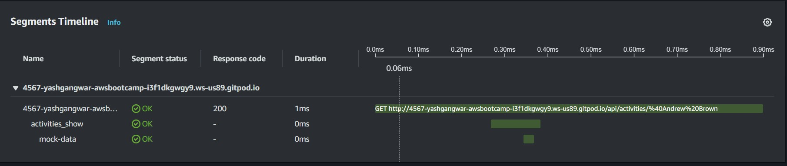

---

## Integrate Rollbar for Error Logging with custom warning error trigger 

Followed the instructions from [Week-2 Rollbar](https://youtu.be/xMBDAb5SEU4) to instrument rollbar in the backend for logging errors and warnings.

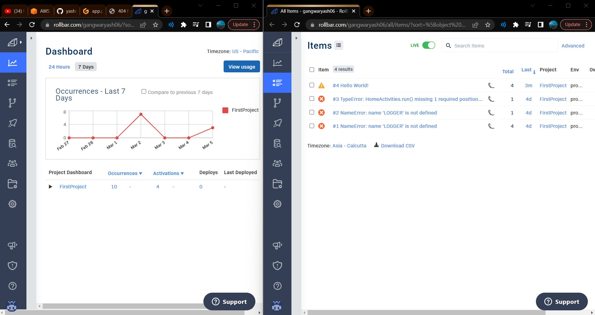
